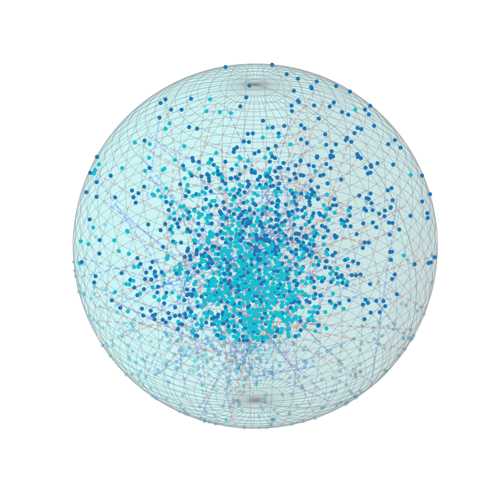
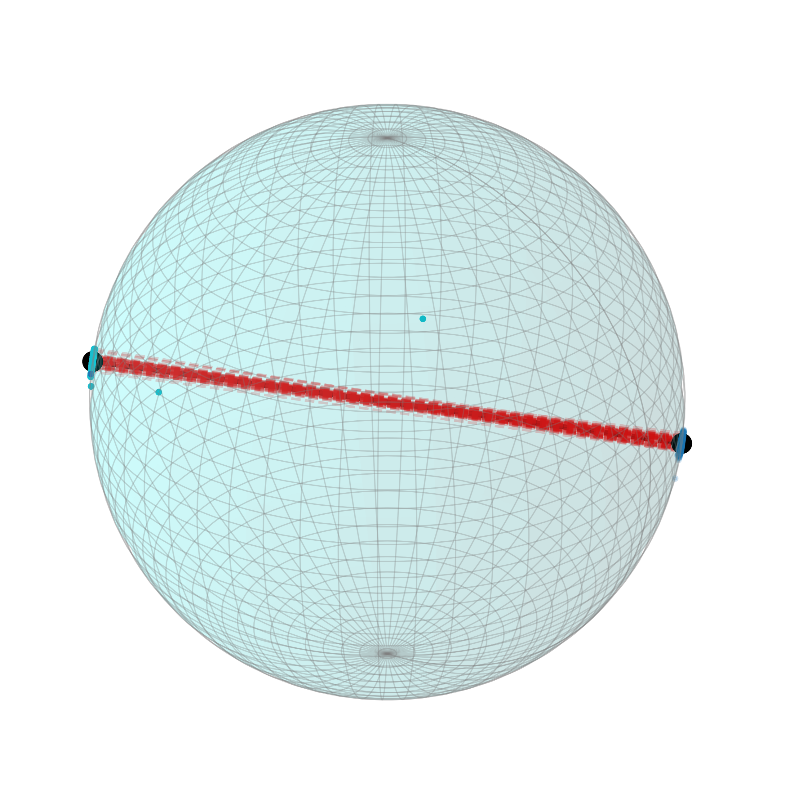
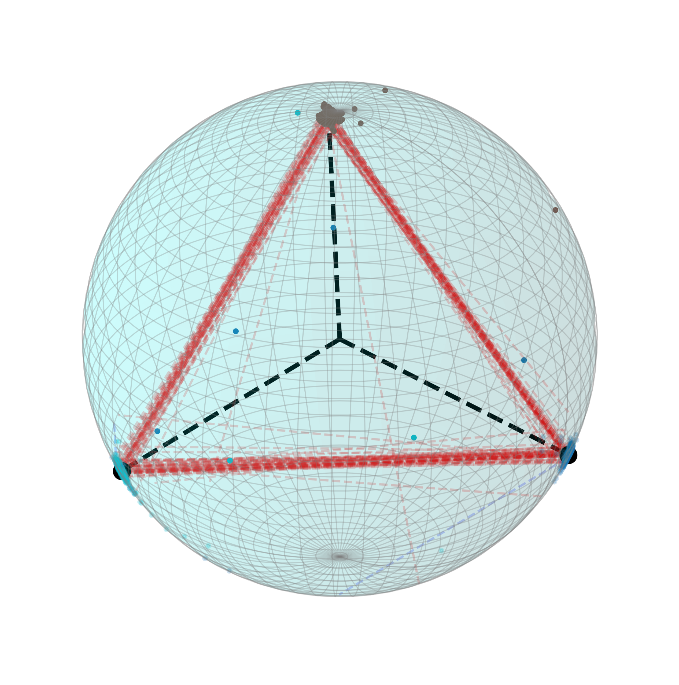
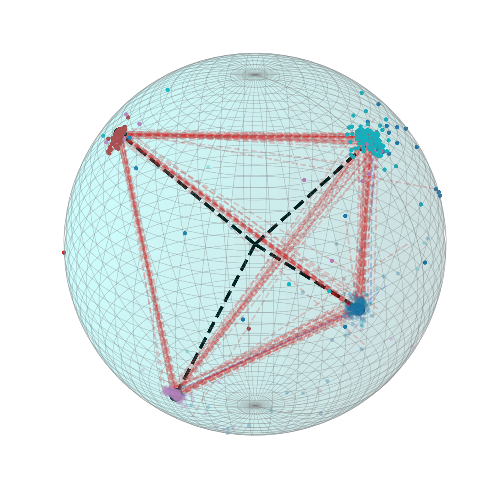

# Sphere
# Sphere
3D Sphere Visualization

  
   
  

  K=2, m=arccos(-1/(K-1))=1 | K=3, m=arccos(-1/(K-1))=1.5 | K=4, m=arccos(-1/(K-1))=1.644

Below are final results of embedding evolutions (each black line links the sphere center and a cluster center found by Kmeans):

  
   
  

